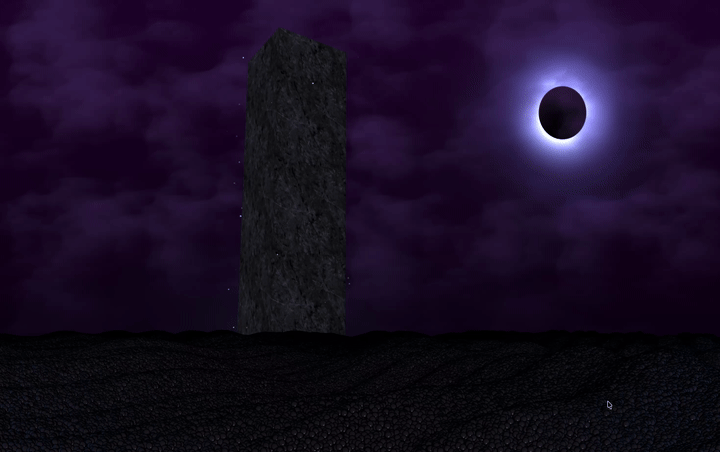

<h1 align="center">Lasting Integrity</h1>
<p align="center">3D OpenGL rendering engine in C++17</p>

<p align="center">
  
  
  
</p>

<p align="center">
  
</p>

A 3D graphics application built with modern OpenGL 4.1 (core profile). It features a custom GLSL shader pipeline, animated lighting, and procedural mesh rendering.

Inspired by the ethereal landscape of *Shadesmar* and the fortress of *Lasting Integrity*.

## Features

- **Custom shader pipeline:** a `Shader` class that reads, compiles, links, and error-checks vertex and fragment shaders at runtime.
- **MVP transformations:** Model/View/Projection matrices with GLM and perspective projection.
- **Animated lighting:** `u_time` and `viewPos` uniforms updated every frame.
- **Manual buffer management:** VAO/VBO setup and attribute pointers.

## Tech Stack

| | |
|---|---|
| Language | C++17 |
| Graphics API | OpenGL 4.1 Core |
| Window/context | GLFW 3 |
| Extension loader | GLEW 2.3 |
| Math | GLM |
| Platform | macOS (Apple Silicon) |

## Project Structure

```text
LastingIntegrity/
├── include/
│   └── Shader.hpp
├── src/
│   ├── main.cpp              # Entry point & render loop
│   └── stb_image.h
├── shaders/
│   ├── vertex_shader.glsl
│   ├── fragment_shader.glsl
│   ├── sky_vertex.glsl
│   ├── sky_fragment.glsl
│   ├── tower_vertex.glsl
│   ├── tower_fragment.glsl
│   ├── spren_vertex.glsl
│   └── spren_fragment.glsl
├── textures/
├── docs/
│   └── preview.gif
├── CMakeLists.txt
└── README.md
```

## Build & Run

**Prerequisites:** [Homebrew](https://brew.sh), then:

```bash
brew install glfw glew glm
```

**Build:**

```bash
clang++ -std=c++17 src/main.cpp -o LastingIntegrity \
  -Iinclude \
  -I/opt/homebrew/opt/glew/include \
  -I/opt/homebrew/opt/glfw/include \
  -I/opt/homebrew/opt/glm/include \
  -L/opt/homebrew/opt/glew/lib -lGLEW \
  -L/opt/homebrew/opt/glfw/lib -lglfw \
  -framework OpenGL -framework Cocoa -framework IOKit -framework CoreVideo
```

**Run** (from the project root, so the shaders are found):

```bash
./LastingIntegrity
```
